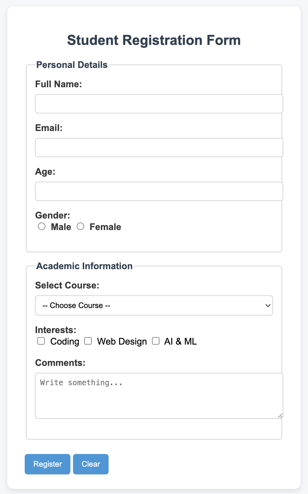
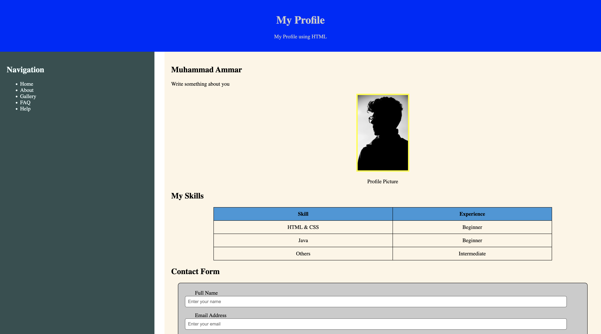

# HTML & CSS Fundamentals

A collection of HTML/CSS practice projects and lab assignments built while learning front-end fundamentals — semantic markup, flexbox layouts, forms, and styling from scratch (no frameworks).

## Highlights

### 🧾 Student Registration Form
A multi-section form demonstrating grouped inputs, native form controls, and clean visual hierarchy.



- `fieldset` / `legend` for grouping **Personal Details** and **Academic Information**
- Full range of input types: text, email, number, radio, checkbox, select, textarea
- Card-style container with soft shadows and rounded corners
- Hover states on submit/reset buttons

**Files:** `Registration_Form.html`

### 👤 Profile Page (Layout v2)
A two-column personal profile page built with Flexbox — sidebar navigation alongside a main content area.


.png)

- Flexbox-based `sidebar` + `content` layout
- Styled data table for listing skills and experience levels
- Contact form embedded in the content area
- Custom image framing (border + background accent)

**Files:** `profile-layout-v2.html`

## Repository Structure

```
├── AICT_Lab5 Html/       # Lab 5 — lists, tables, forms, linking pages
├── AICT_Lab6/             # Lab 6 — nested lists, form controls
├── Mid-Term-Practice/     # Mid-term practice project
├── Practice/              # Standalone nav/footer styling practice
├── profile-layout-v2.html # Featured: flexbox profile page
├── Registration_Form.html # Featured: multi-section registration form
├── profile-card.html/css  # Compact profile card component
├── product-card.html/css  # Product display card component
└── ...additional practice files (lists, headings, CSS basics)
```

## What This Covers

- Semantic HTML structure (`header`, `nav`, `table`, `form`, `fieldset`)
- Flexbox layouts (sidebar/content, centered cards)
- Styling forms: labels, inputs, textareas, buttons, hover states
- Working with images: sizing, borders, object framing
- Iterating on the same layout across multiple versions to improve structure and styling

---

## Author

**Muhammad Ammar Saleem**

[](https://github.com/m2ammar)
[](https://www.linkedin.com/in/muhammad-ammar-b533a0323/)
